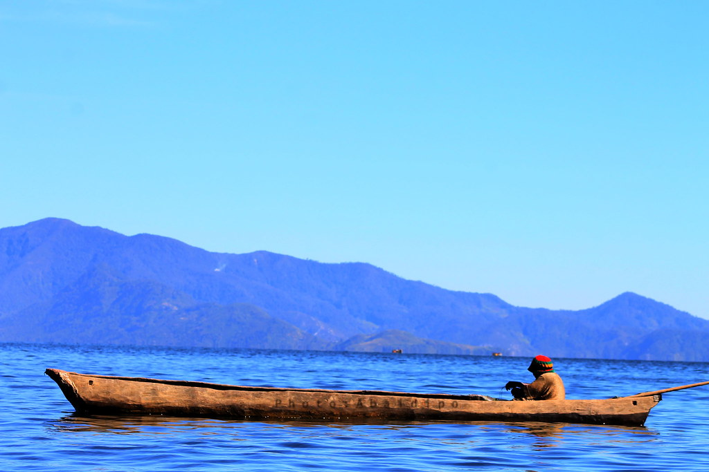
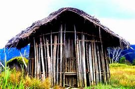
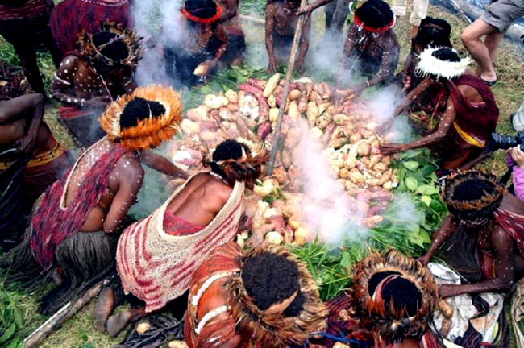
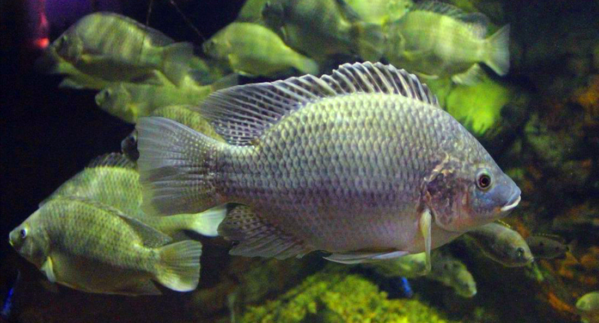
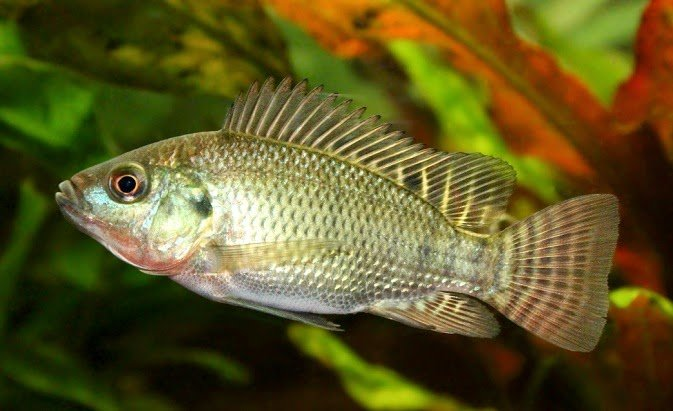
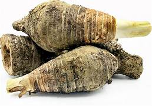
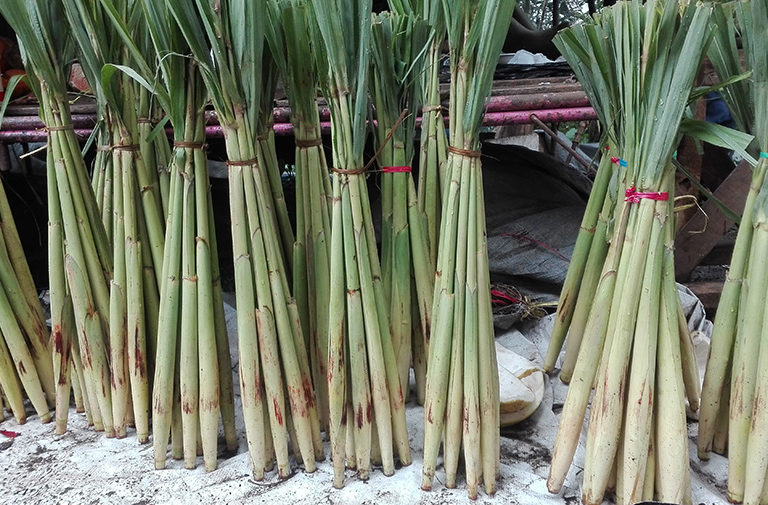
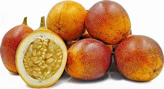

<!DOCTYPE html>
<html lang="id">
<head>
    <meta charset="UTF-8">
    <meta name="viewport" content="width=device-width, initial-scale=1.0">
    <title>Kelestarian Danau Paniai & Pangan Lokal Paniai</title>
    <link rel="stylesheet" href="styles.css">
</head>
<body>
    <!-- Header -->
    <header>
        

            <h1>Kelestarian Danau Paniai & Pangan Lokal Paniai</h1>
            <nav>
                <ul>
                    <li><a href="#home">Beranda</a></li>
                    <li><a href="#destinasi">Destinasi Wisata</a></li>
                    <li><a href="#pangan">Pangan Lokal</a></li>
                    <li><a href="#kontak">Kontak</a></li>
                    <li><a href="#tentang">Tentang Kami</a></li>
                </ul>
            </nav>
        

    </header>

    <!-- Hero Section -->
    <section id="home" class="hero">
        
        

            <h2>Selamat Datang di Danau Paniai</h2>
            
Mengenal lebih dekat Danau Paniai, salah satu danau terindah di Papua Tengah, dengan kekayaan Hayati dan pangan lokal yang melimpah.

        

    </section>

    <!-- Destinasi Wisata -->
    <section id="destinasi" class="section">
        

            <h3>Kelestarian Danau Paniai</h2>
            
Kabupaten Paniai, yang terletak di Provinsi Papua Tengah, memiliki kekayaan tradisi, adat, dan budaya yang sangat unik. Kabupaten paniai juga ada beberapa suku.

                 
1. Suku Mee,Moni,Walani dan Auye (MeeMoWaAu)

                   Kabupaten Paniai didominasi oleh dua suku besar, yaitu Suku Mee,Moni,Walani dan Auye (MeeMoWaAu). Keempat suku ini memiliki adat istiadat yang kaya dan memainkan peran penting dalam kehidupan sosial masyarakat.
                
                 
2. Upacara Adat

                   Upacara adat merupakan bagian penting dari kehidupan masyarakat Paniai. Beberapa di antaranya adalah:
                     
- Upacara kelahiran: Digelar untuk merayakan kelahiran anak dan memberikan restu untuk masa depannya.
                     
- Upacara kematian: Upacara ini dilakukan dengan penuh penghormatan bagi arwah yang meninggal, dan masyarakat percaya pada adanya kehidupan setelah kematian.
                   
                 
3. Bakar Batu (Ena Moga)

                     Bakar Batu adalah tradisi memasak bersama yang melibatkan seluruh anggota komunitas. Makanan dimasak menggunakan batu panas yang ditumpuk, dan biasanya meliputi daging babi, ubi, dan sayuran. Ini merupakan bentuk simbol kebersamaan dan persatuan suku.
                
                 
4. Tarian Tradisional

                   Tarian-tarian tradisional di Paniai umumnya digunakan untuk menyambut tamu, perayaan, atau ritual adat. Tarian ini diiringi alat musik tradisional seperti tifa dan nyanyian khas suku-suku lokal.
                
                 
5. Rumah Adat Honai

                   Rumah adat Honai adalah rumah tradisional berbentuk bundar dengan atap jerami. Honai digunakan sebagai tempat tinggal sekaligus tempat musyawarah suku. Ini menjadi simbol kebudayaan orang Mee,Moni,wolani dan Auye (MeeMoWaAu)  juga melambangkan keterikatan masyarakat dengan alam.
                
                
6. Sistem Pertanian Tradisional

                   Masyarakat Paniai banyak bergantung pada pertanian dengan menggunakan cara tradisional. Mereka menanam ubi jalar, sayuran, serta memelihara babi, yang juga menjadi bagian dari acara adat dan persembahan kepada leluhur.
                
                
 7.Bahasa Lokal

                   Selain Bahasa Indonesia, masyarakat Paniai juga menggunakan bahasa lokal seperti Bahasa Mee, moni, wolani dan Auye (MeeMoWaAu). Bahasa ini mencerminkan kekayaan identitas dan warisan budaya daerah.
                
                
Tradisi dan budaya Kabupaten Paniai ini memiliki nilai-nilai kebersamaan, penghormatan terhadap alam, dan sikap gotong royong yang kuat, serta diwariskan turun-temurun dari generasi ke generasi.
            <!-- Alat Budaya Tradisional -->
            

                <h3>Alat Budaya Tradisional</h3>
                

                    

                        
                        
Perahu Tradisional (Mee koma)

                    

                    

                        
                        
Rumah Tradisional (Emawa)

                    

                    

                        
                        
Pakaian Adat Tradisional (koteka/moge)

                    

                    

                        
                        
Tarian Tradisional (Emai yibu)

                    

                    

                        
                        
Tradisi bakar batu (dua gapi)

                    

                    

                        
                        
Alat musik tradisional (kaido)

                    

                    

                        
                        
senjata tradisional (uka/mapega)

                    

                    

                        
                        
Alat Pertanian Tradisional

                

            

            <!-- Galeri Foto -->
            

                <h3>Galeri Foto</h3>
                

                    
                    
                    
                    <!-- Tambahkan lebih banyak gambar sesuai kebutuhan -->
                

            

        

    </section>

    <!-- Pangan Lokal -->
    <section id="pangan" class="section bg-light">
        

            <h3>Kekayaan dari Alam Paniai</h2>
            
            <!-- Ikan Danau -->
            

                <h3>Ikan Danau</h3>
                

                    

                        
                        <h4>Ikan Mujair</h4>
                        
Manfaat bagi kesehatan dan peranannya dalam ekosistem Danau Paniai.

                    

                    

                        
                        <h4>Ikan Nila</h4>
                        
Sumber protein lokal yang banyak dikonsumsi masyarakat Paniai.

                    

                    

                        
                        <h4>Ikan Mas</h4>
                        
Ikan yang populer dalam berbagai hidangan tradisional.

                    

                    

                        
                        <h4>Udang Danau</h4>
                        
Udang lokal yang menjadi bagian penting dalam kuliner Paniai.

                    

                

            

            <!-- Tanaman Pangan Lokal -->
            

                <h3>Tanaman Pangan Lokal</h3>
                

                    

                        
                        <h4>Ubi Jalar</h4>
                        
Sumber karbohidrat utama dalam diet lokal.

                    

                    

                        
                        <h4>Keladi</h4>
                        
Tanaman yang digunakan dalam berbagai masakan tradisional.

                    

                    

                        
                        <h4>Sayur Merah</h4>
                        
Sayuran lokal yang kaya akan nutrisi.

                    

                    

                        
                        <h4>Yatu</h4>
                        
Tanaman unik yang tumbuh di sekitar Danau Paniai.

                    

                    

                        
                        <h4> Buah Terung Belanda</h4>
                        
Buah lokal Terong Belanda(Emo buah) berwarna merah atau hijauh dengan rasa manis-asam. Buah ini sering digunakan dalam makanan lokal di paniai, kaya akan vitamin C dan antioksidan..

                    

                    

                        
                        <h4>Buah Markisa</h4>
                        
Buah lokal yang digunakan dalam berbagai olahan makanan dan minuman.

                    

                

            

            <!-- Resep Tradisional -->
            

                <h3>Resep Tradisional</h3>
                
 
                    

                        <h4>Sup Ikan Mujair</h4>
                        
Resep tradisional sup ikan menggunakan ikan mujair segar dari Danau Paniai.

                        <!-- Anda bisa menambahkan gambar atau video resep di sini -->
                    

                    

                        <h4>Tumis Sayur Merah</h4>
                        
Resep tumis sayur merah yang lezat dan bergizi.

                    

                    <!-- Tambahkan lebih banyak resep sesuai kebutuhan -->
                

            

        

    </section>

    <!-- Kontak -->
    <section id="kontak" class="section">
        

            <h3>Kontak</h2>
            <form action="#" method="post">
                <label for="nama">Nama:</label>
                <input type="text" id="nama" name="nama" required>

                <label for="email">Email:</label>
                <input type="email" id="email" name="email" required>

                <label for="pesan">Pesan:</label>
                <textarea id="pesan" name="pesan" rows="5" required></textarea>

                <button type="submit">Kirim</button>
            </form>

            <!-- Informasi Kontak Tambahan -->
            

                <h3>Informasi Kontak</h3>
                
<strong>Alamat:</strong> Kantor buapati, Jl. Raya Poros Madi Distrik paniai timur 

                
<strong>Email:</strong> <a href="sayembaragimpaniai.id">sayembaragimpaniai@gmail.com </a>

                
<strong>Telepon:</strong> +6282314033006

                
                

                    <h4>Sosial Media:</h4>
                    
                    
                    
                

            

        

    </section>

    <!-- Tentang Kami -->
    <section id="tentang" class="section bg-light">
        

            <h2>Tentang Kami</h2>
            
Situs ini dikelola oleh komunitas lokal yang peduli terhadap kelestarian Danau Paniai dan kesejahteraan masyarakat sekitarnya melalui promosi wisata yang berkelanjutan dan penggunaan pangan lokal.

        

    </section>

    <!-- Footer -->
    <footer>
        

            

                <a href="#home">Beranda</a>
                <a href="#destinasi">Destinasi Wisata</a>
                <a href="#pangan">Pangan Lokal</a>
                <a href="#kontak">Kontak</a>
                <a href="#tentang">Tentang Kami</a>
            

            

                
                
                
                
                <!-- Tambahkan ikon sosial media lainnya sesuai kebutuhan -->
            

             <!-- Google Maps -->
            

            
<iframe src="https://www.google.com/maps/embed?pb=!1m18!1m12!1m3!1d15922.2739457637!2d136.30747804355437!3d-3.9022220371439857!2m3!1f0!2f0!3f0!3m2!1i1024!2i768!4f13.1!3m3!1m2!1s0x68221884715c6a27%3A0x3ab182ea3071e7af!2sPaniai%20Lakes!5e0!3m2!1sen!2sid!4v1729542689240!5m2!1sen!2sid" width="600" height="450" style="border:0;" allowfullscreen="" loading="lazy" referrerpolicy="no-referrer-when-downgrade"></iframe>

            
<iframe src="https://www.google.com/maps/embed?pb=!1m18!1m12!1m3!1d3980.381649517798!2d136.41905537473417!3d-3.9414507960322838!2m3!1f0!2f0!3f0!3m2!1i1024!2i768!4f13.1!3m3!1m2!1s0x68223dcaf2773a2f%3A0xc4feffcf37866c41!2sKantor%20Bupati%20Paniai!5e0!3m2!1sen!2sid!4v1729542520838!5m2!1sen!2sid" width="600" height="450" style="border:0;" allowfullscreen="" loading="lazy" referrerpolicy="no-referrer-when-downgrade"></iframe>

            
&copy; 2024 Kelestarian Danau Paniai & Pangan Lokal Paniai. Semua hak dilindungi.

            
&copy; by. Otniel Degei

        

    </footer>

    
</body>
</html>
